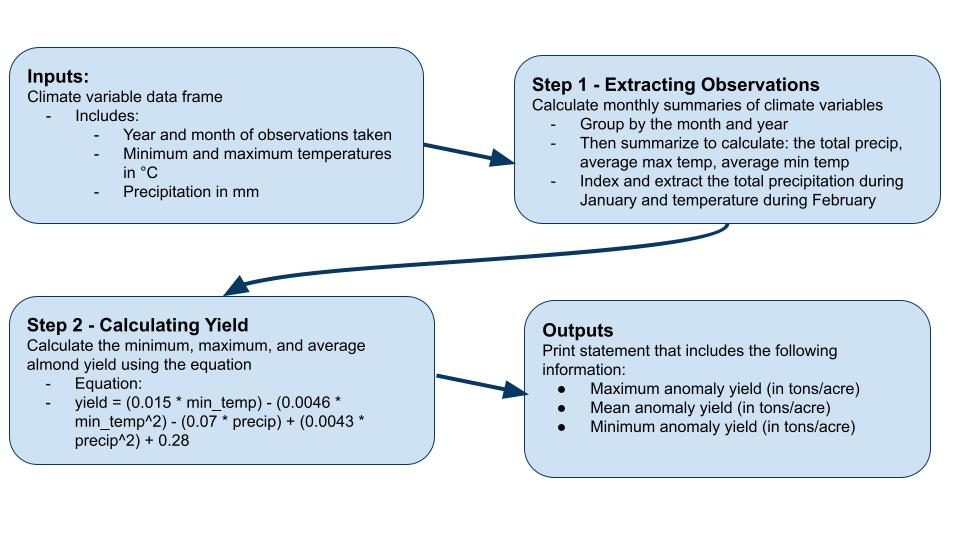

```{r setup, include=FALSE}
knitr::opts_chunk$set(echo = TRUE)
```

```{r}
#load packages ----
library(readr)
library(tidyverse)
library(here)
```



```{r}
#read in data ----
climate_data <- read_delim(here("Assignment_2", "clim.txt"), delim = " ")

#source in the function ----
source(here("Assignment_2", "calculate_almond_yield.R"))

#Use the function on our climate data ----
calculate_almond_yield(climate_data)
```
